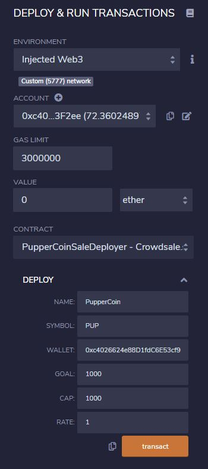
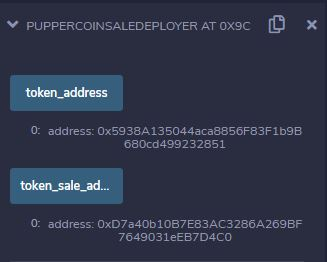
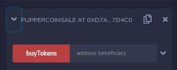

# Pupper Coin

## Attracting A Crowd! ##

---

My company has decided to crowdsale their PupperCoin token in order to help fund the network development.

This network will be used to track the dog breeding activity across the globe in a decentralized way, and allow humans to track the genetic trail of their pets.

I have created an ERC20 token that will be minted through a `Crowdsale` contract that I have leverage from the OpenZeppelin Solidity library.

This crowdsale contract will manage the entire process, allowing users to send ETH and get back PUP (PupperCoin).
This contract will mint the tokens automatically and distribute them to buyers in one transaction.

---

## Testing the Crowdsale ##

In Remix, select the PupperCoinSaleDeployer for the drop down menu and in the "Deploy" variables set the following:
Name - "PupperCoin"
Symbol - "PUP"
Wallet - the address of your Metamask
Goal - *should be 300*
Cap - crowdsale cap
Rate - rate of ETH to Tokens

Click transact and confirm the transaction in the Metamask pop-up.

Now that the SaleDeployer is deployed, expand the drop down under Deployed Contracts and copy the two addresses:

From the drop down menu, select PupperCoin and paste the token_address to the At Address field and click the button.

Swap to the PupperCoinSale contract and paste the token_sale_address to the At Address field and click the button.

In the now deployed PupperCoinSale contract, you can now enter an address as the beneficiary and make transactions through the crowd sale!

